Portraits of Territory
======================

- Introduction: Of One Territory and its Representations
- I. The Drawn World
- II. The Printed Globe
- III. The Photographed Earth
- IV. The Online Map
- Conclusion: On Creations and Appropriations of a Portrait
- Sources

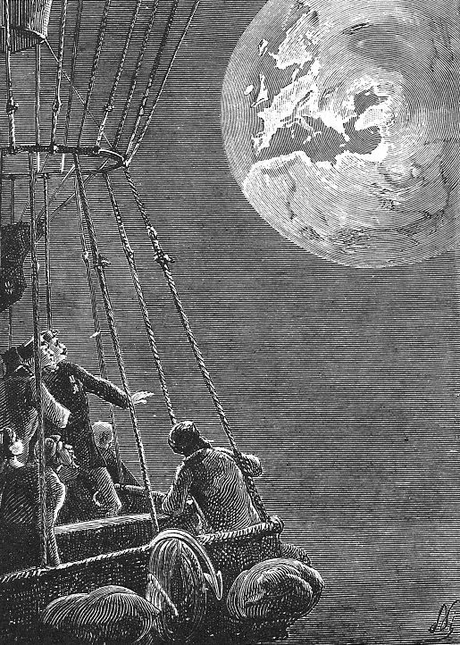

*Jules Verne’s *Off on a Comet*, drawing by Paul Philippoteaux, 1877*

Introduction: Of One Territory and its Representations
------------------------------------------------------

“The map is not the territory” was the analogy used in 1933 by American philosopher and scientist Alfred Korzybski, along with “the word is not the thing”, to describe the posture in which one, to represent oneself a form of reality, may use an abstracted representation of this reality, crossing image and language. Korzybski did not study geography, maps or the concept of territory, but considered this example of the map and the territory to be the most alike to give a clear form to his idea.

The territory could be understood here as a space physically and culturally appropriated by man, and the map its representation.

In *Simulacra and Simulation* [1], Jean Baudrillard establishes three distinctive historical eras of relations between realities and their representations—*simulacras*. A premodernity during which myths followed realities through interpreted, inaccurate and unique objects; modernity and industrial revolution through which reality and its representation tend to lose distinction in the march of science and mass reproduction of goods; and postmodernity, through which the simulacra precedes its reality. An *hyperreality* taking forms, according to Baudrillard, through pictures of war in mass medias, the stock markets’ flow of money informations, and the relation between a territory and its map:

> The territory no longer precedes the map, nor does it survives it. It is nevertheless the map that precedes the territory—precession of simulacra—that engenders the territory.

Considering a form of territory: the nation, the constructed and established ideas of a shared culture, language and history carry often much more representations of the nation than its map. If we exclude a few exceptions (France being nicknamed *the hexagon* due to its shape on the map) this idea of the map preceding, generating the territory cannot apply to most territories.

The ideas of World, Globe, Earth, when considered as territories evoke all the known potential lands and social structures unified under a single point of view: a unique territory. Those, *this* territory is the one which has been the most and earliest represented. As a shared social, cultural or political appropriation of a land never existed within such a unique global territory, one could say it only existed within its representations, through religions, political idealism (Proletarian Internationalism), business (international finance), technologies (World Wide Web). Baudrillard’s claim can be interpreted within this scope: the ideas of a global territory only emanated through their representations.

In *The Gutenberg Galaxy* [2] and later in *Understanding Media: The Extensions of Man* [3], Marshall McLuhan develops two related ideas that can be linked to the representations of the territory: the idea that the printing press—and regarding the map, the mechanized printmaking and engraving developed at the same time—triggered a shift of consciousness that would deeply affect European culture; and in the latter the idea that the medium of information, or representation, carries a deeper importance in the perception of a depicted reality, a *message*, than the content itself. A similar relation may exist between the territory and its representation.

Baudrillard’s point of view takes under McLuhan’s reading another perspective: if ideas of a unique, global territory only existed through their representations, they did not evolve following an historical continuous path. From different mediums of representation emanate different perceptions of the territory. For the importance they play in the representation of the territory, four different mediums stand out: drawing, printing, photography and websites. These four mediums influence a different perception, a different message of territory, independently from the historical, cultural, social and political context through which they deliver the idea of a unique territory. To differentiate those different perceptions, one can use four different words, four different elements of language for four different mediums: the drawn World, the printed Globe, the photographed Earth and the online Map.

I. The Drawn World
------------------

Drawings carry the idea of unique territory as a “World”. The World is not a land, a space. Accurate shapes and borders are thus superficial in the territory as World: there is no reason to locate something geographically on the World. The World is detached from reality and does not serve any functional meaning, the World acknowledges its nature as a story. It manifests itself into a narration, a unique plot to support one specific point of view, the single perspective of an author on one idea of unique territory, through evolving esthetics and choices of representation. Because it manifest itself through drawings, the World is also represented through a single object, a piece of art: a drawn World, through its uniqueness, its authorship and its narrative nature has an aura. It borrows structures to the real world: geographical, cultural, and natural details to build a unique artifact disconnected from its reality.

The mappa mundi (name given today to medieval world representations) printed in Jean Mansel’s *La Fleur des Histoires* [4] (The Flower of Histories), a manuscript narrating history from the Genesis—a “global” starting point for the people of the World—to its contemporary French time, thus doesn’t represent the known territories through functional features. This kind of representations were not meant to be used by geographers or navigators: more detailed maps of seas and borders, of smaller precise territories existed at the time for those functions.

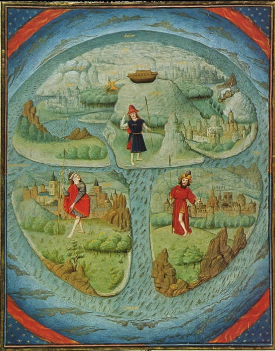

*French mappa mundi attributed to Simon Marmion, in Jean Mansel’s *La Fleur des Histoires*. Valenciennes, 1459–1463. It represents three “continental” island organised around the fertile crescent, cradle of christianity. Asia on the top, Europe on the bottom left and Africa on the bottom right (the concept of continents and their names would be developed later).*

Known as a T & O map, this mappa mundi depicts a World seen through a cultural, historical and religious scope: around the fertile crescent, the land considered at the time to be the birth of civilisation, are organised three continents, three islands connected to three different civilisations: one at the top representing the continent we would called Asia today, Europe on the bottom left, and Africa on the bottom right. These three islands, in a shape of T, were enclosed in the O of a round planet of water, without taking account of the later standards establishing the relation “North = Top”.

This mappa mundi did not hide its empirical nature. The function of the image being to interpret, illustrate an idea of the World conveyed at the time, precise shapes of continents and respects of scales were left aside. A personal way of illustrating the world—detached from accurate geography—emphasizing on meaningful details would be considered more appropriate to interpret an idea of what the World was. Though still depicting the Sinai Peninsula and the Black Sea, the illustration underlines with only several details, the nature (through the trees), the architecture (through the depiction of one city per continent) and the fashion (representing a man on a exaggerated scale) of the three continents. Located in the center of the image a detail widely understandable at the time, common to all abrahamic religions, the wreck of Noah’s Ark standing on top of the Mount Ararat, in nowadays east Turquia, would represent the religious—historical at the time—starting point from which started those three civilisations.

Approximatively five centuries later, Saul Steinberg’s cover for The New Yorker, entitled “View of the World from 9th Avenue”, though intentionally ironical and reducing, describes a World’s point of view from an apparently rather similar approach. The emphasis of his personal point of view—supposedly being a ironical New Yorker’s way of seeing the World—leads to an over exaggerating contrast between a view of Manhattan, represented in a fashion that could recall through its perspective the human sight, the Hudson river that still keeps an importance, the rest of the US which are reduced to a simple unprecised square stuck in between other territories, with the arrogance of only drawing a few table rocks to overview a landscape. The rest of the known territory, disappears beyond a ridiculously small ocean, with left behind words on white landmasses, to recall its shadow.

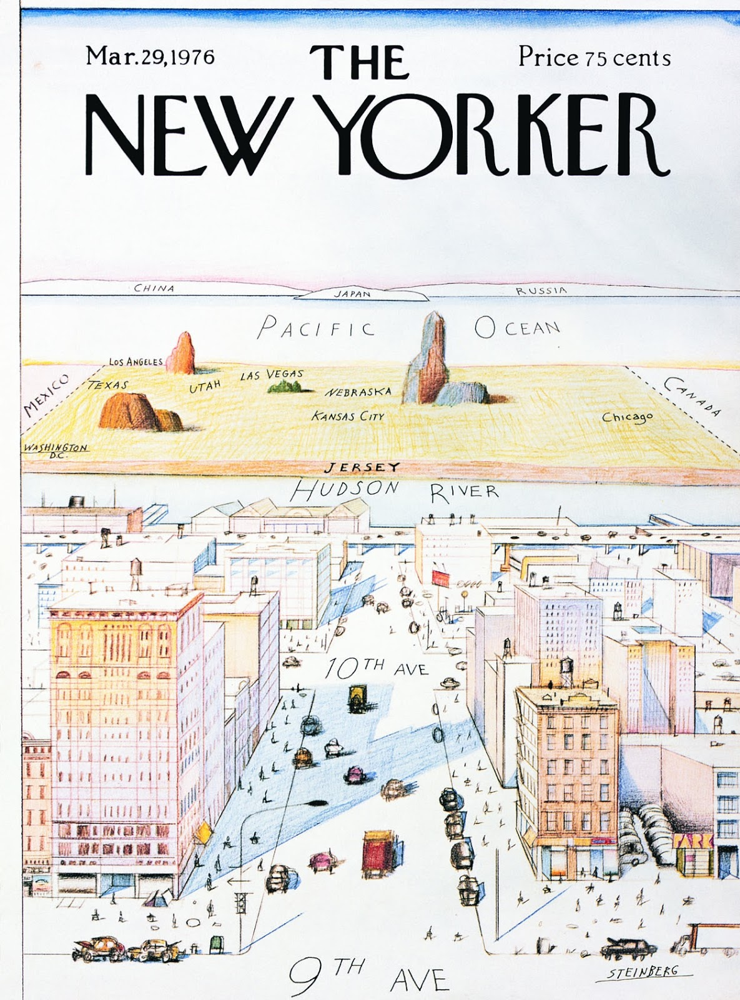

*Saul Steinberg’s cover for The New Yorker, untitled “View of the world from 9th Avenue”, 1976*

As such the drawn World takes a certain distance to its reality, being the point of view of an author, far from the restrictions of functionality in a unique thus non dominant posture, it interprets within an author’s perspective the idea of a unique territory.

II. The Printed Globe
---------------------

The printed Globe appears at the same time than the development of printing processes, great discoveries and technical achievements. The discovery of America and its report on the printed Globe makes a break in the representation of the territory: flattened on a flat rectangle of paper, the Globe becomes an unfinished image that has to be filled with conquests and discoveries. Two races go side by side: discovering new territories, establishing borders of continents and limits of oceans; and filling with upcoming lines the missing parts to be linked of the printed Globe.

Because the image is printed, it becomes a multiplied produced object and by such has to become commercialized. The function the printed Globe could filled up at the time was maritime navigation, and for that it had to flatten with accuracy the Globe. The inner values of the printed Globe lie in the shapes, the lines it represents. Those lines, coasts between continents and seas try to apply as much as possible the structure of the real land. The representation becomes thus a projection of the Globe: all other information that could be added to the map simply become overlaps of the lines that are inherently sticking to the real shapes of lands. The printed Globe doesn’t represent anything else than the territory considered as a flattened deep space, a closed object, a stretched ball, deformed to fill the restrictions of a printable rectangle of paper.

The geographer Élysée Reclus would write in 1868 in *The Earth, description of the phenomenons of life on the globe* [5], fifteen years before his anarchistic and ecological writings that would let him famous today:

> Finally, when man will know all the surface of the globe, from which he calls himself master, and when the words of Colombus would have became true to all of us: El Mundo es poco, Earth is small! Then the great work of geography will be, not to explore foreign lands, but to study deeply the details of the area one inhabits, and to show the role of every part of the earth organism in the life of the whole.

Thus the to-be-finished representation of a whole Globe represented on paper would become the image for conquest, colonisation and control. Because the lines it prints on the paper are supposedly coming from an accurate representation of the world, a real representation, all the information that would cover it would be charged of this aura of truth. Borders of nations, names on the Globe projection are printed, unchangeable stiff led prints for unchangeable dictatorial truths.

The printed Globe did not change much since the XV° century, as map projections were mathematically defined, the projected globe was just filled over the years with new lines and new shapes for new discoveries: Americas, Greenland, Australia and the Oceanian islands, and progressively Antarctica. The printed Globe was set as a standard by the Europeans on the places they would reach, and the borders lines of the conquered lands they would reach over years would always be printed as inevitable truths, while changing over the decades.

The printed Globe, as it evolved during the industrial revolution, as mass produced images, had totally lost its aura as object, and was going toward a status of unique object to a dematerialized object which only value is the mathematical, rather accurate global territory it depicts. The image, established as a standard in all the conquered places had also lost its initial function of navigational object, to carry the true lines of political control and oppression.

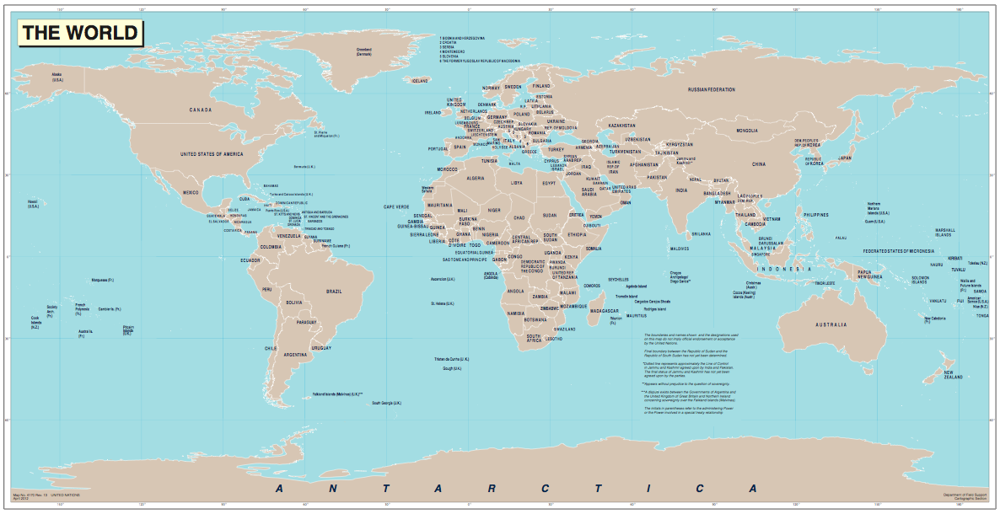

*United Nations World map 09/12/13, downloaded on *The United Nations Cartographic Section*, http://www.un.org/Depts/Cartographic/english/*

The United Nations’ “The World” printed Globe expresses a paroxysm of this shift from a small produced functional printed globe to an object building arbitrary informations over the scientific aura of the image. The U.N. printed Globe inherits some particular features from the navigational Mercator projection: North on the top and South on the Bottom, Equator in the center, and deformations due to the flattening of the Globe on a rectangle. All the informations related to the territory as a space are omitted except the borders of oceans, represented within perfect accurate shapes, which are printed with the same graphical code than the constructed borders of nations, giving the latter a natural scientific value. But those borders, printed as natural shapes, are renewed at every new unstable political change, and the new version replaces the former, which stays unable to access, as a embarrassing archive of political map.

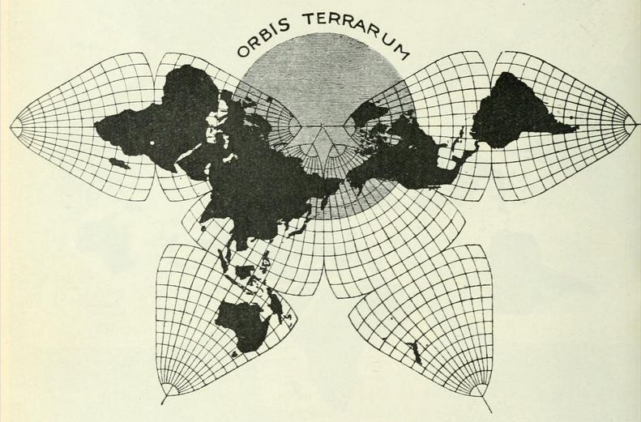

*Bernard J.S. Cahill’s *Butterfly Map*, first published in the article *An Account of a new land map of the world*, in The Scottish Geographical Magazine, 1909; further elaborated in *A World Map to End World Maps*, 1934*

The omnipresence of the mathematical Mercator projection, deforming the sizes of continents, getting bigger as far a they were from the equator, but which is the most useful one when it comes to maritime navigation, led a lot of cartographers and thinkers to propose new mathematical projection that would distribute the land masses more evenly, and more accurately on the printed Globe. As J.S. Cahill would propose in the early XX° century such a map [6], for the purposes of offering a global Globe projection that would be more accurate to learn the structures and lines of the real lands, those alternative Globe projection became loaded with political resonance. Because the territories emanating from the printed globe could not be separated from their political implications, the globe projections by Buckminster-Fuller, and later by Peters would serve as political images of the new territories emerging from decolonisation, and utopian political movements.

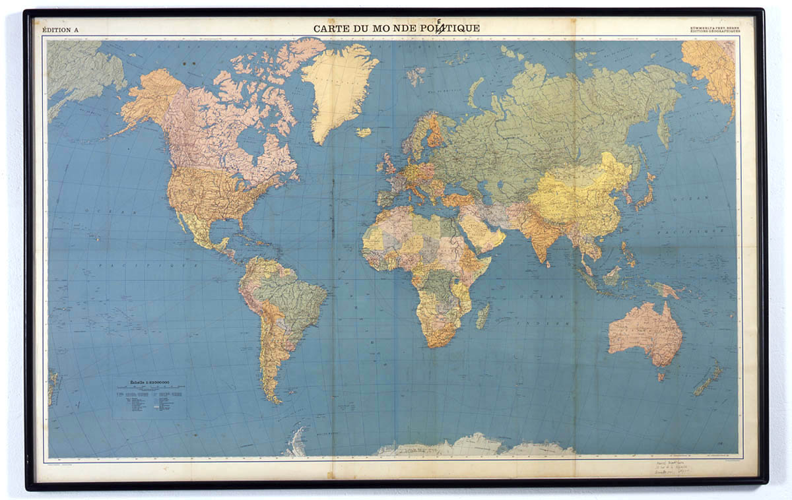

*Marcel Broodthaers, *Carte du monde poétique*, 1968*

Marcel Broodthaers in its *Monde Poétique* (Poetical World) emphasis on the distortion created by the juxtaposition of the ocean natural lines and the national borders, presented on a absolute same scale, revealing by an apparent writing mistake (“Monde Politique” becomes “Monde Poétique”) the poetical arbitrariness and artificiality of the political printed Globe. An action that could recall René Magritte’s *The Treachery of Images*, on which the act of writing reveals the gap between the reality of an object and the shifted state of reality of its representation.

III. The Photographed Earth
----------------------------

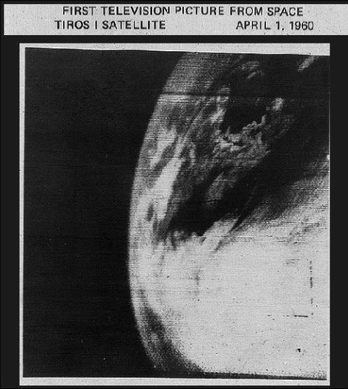

*First television picture of Earth from space, taken April 1, 1960 from TIROS­-1, first orbital satellite carrying a camera with television transmitter, launched the same day from Florida, U.S.*

In 1966, TIROS-10, the last satellite from a program that first sent partial pictures of Earth was deactivated. 23 days later, the Lunar Orbiter I satellite was in orbit around the Moon to map its surface in prevision of the Apollo program. The scientists in charge of the satellite took the opportunity to shift the direction of the camera to capture the first picture of the full Earth, thus endangering the mission. Those distant sight did not carry scientific data, the Earth was obviously known to be round. The latter picture was even shot under a certain uncontrolled excitement. Through the fat grain, wave alterations and random framing of these radio transmitted, reconstructed photographs, one could reach towards experiencing the planet as a limited, naturally bordered land.

The idea of a global territory as the Earth, the planet, explodes through its photographic representation. The photography shows a territory totally autonomous from any human cultural and social construction and representation. The cultures and languages, the lines of continents and human control: names, artificial borders totally disappear, eclipsed by the naturality of the planet, hidden under clouds and storms. As the photograph gets colored, the overwhelming scale of the water in the oceans get so obvious and so disproportionate in comparison to the living habitat of men, and the ridiculous scale of its tiny artificial constructions that the image became quickly an icon for worship towards the importance of the planet.

The photographed Earth, generating an idea of a territory separated from human constructions, often linked to power, was quickly used as a symbol for global utopian politics. The first *Whole Earth Catalog* [7] used it as a manifesto on its cover page, as a global symbol of its utopian ambitions. The aim of the catalog was to collect an extensive collection of manuals to build tools, useful objects, and technological devices, with the ideal of liberating the individuals, or groups of individuals from the powers controlling the knowledges to build such tools and devices. The catalog being sold to an affordable price, it would allow earthwide communities to live and develop autonomously from those powers, with a shared contemporary knowledge. Its editor Stewart Brand saw in this picture a symbol, a trigger for a collective consciousness of belonging to a same community, a phenomenon that would fit his ideals of peace, and global autonomy for the individuals and small communities. Worshiping both the idea of independence toward powers of knowledge, economy and politics, and the idea of technological and scientific progress that was brought by the technologies of the photographed Earth.

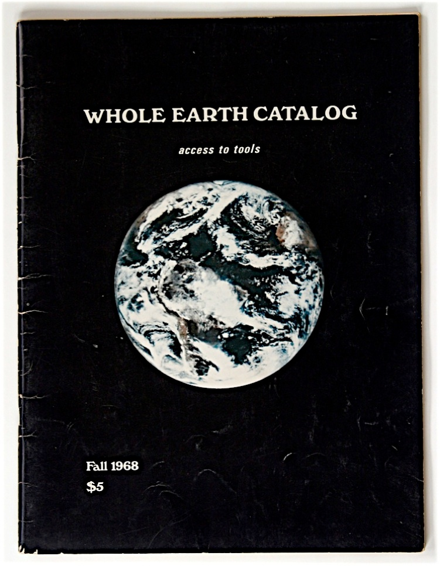

*Cover of the first *Whole Earth Catalog*, Fall 1968*

But the territory generated by the photographed Earth embedded another layer of lecture. The photographed Earth was a representation resulting from two main technological achievements in the United States: the progress of the television waves broadcasting and the ability to send satellites in gravitational orbit. Mastering television broadcasting would allow media powers to diffuse a single information, without debating opposition, through an increasing amount of territories, a strategy of deep, soft power. The images of the first man on the moon, in 1968, with a black and white Stars and Stripes artificially floating in the striking landscape of Moon under earthlight would be the most seen event on television before a long time. The ability to send satellites in orbit, and their capacity to photograph the whole unreached and unstudied lands on the planet, to store accurate data of all the continental lines, the shapes of deep rivers lost through unaccessed forests, isolated islands and the precise relief of Antarctica would turn the territory lines of the printed Globe into undeniable scientific data, giving it a new scientifically exact accuracy, and thus to all the informations that would be overlapped to its printed structure. The reality of the photographed Earth would turn the printed Globe into a representation of reality. The photographed Earth, which could have been a symbol for a territory liberated from the arbitrariness of cultural and social signs of the territory was more than ever the manifestation of the military, cultural and political power of a few nations.

Ironically, the first photograph of Earth was taken by a United States program, from a german V-2 rocket, itself a result of the trouble experiences of World War II, and be used as a storyline by Thomas Pynchon, in *Gravity’s Rainbow* [8] to emphasis the increasingly complex experiences of reality that were brought by scientific theories, challenging the installed law of mathematical norms of reality such as the theory of relativity, making relative and complex the idea of space regarding time, or the quantum mechanics, introducing randomness in the physical manifestations of particles.

IV. The Online Map
------------------

The online Map territory sanctuaries the triumph of the individual using the map as a tool to locate and orientate oneself. The whole territory it generates is centered on the one spectator of the online tool. The tools of the zoom and the drag allow and influence the user of the online Map to center the territory on himself. The stiffness of the scale, which characterizes all the over representations of territory blows up as the spectator of the online map zooms from a macro representation of the territory, inherited from the Mercator projection of the printed Globe, to the street one locates oneself.

The loading of the U.S. based Google Maps, the Chinese based Baiku and other online Map services from a fixed computer as well as a portable devices center the map on the spectator. The information overlays and collapses: real-time traffic, political borders, photographic Earth views, and commercial informations. But the online Map does not challenge the spectator: as an algorithmic designed tool, the map proposes the spectator what he needs, hiding its limits, its unreachable parts under an overload of informations. The Map seems to become, through its presets, the personal territory of its user, only taking form through its functionalities.

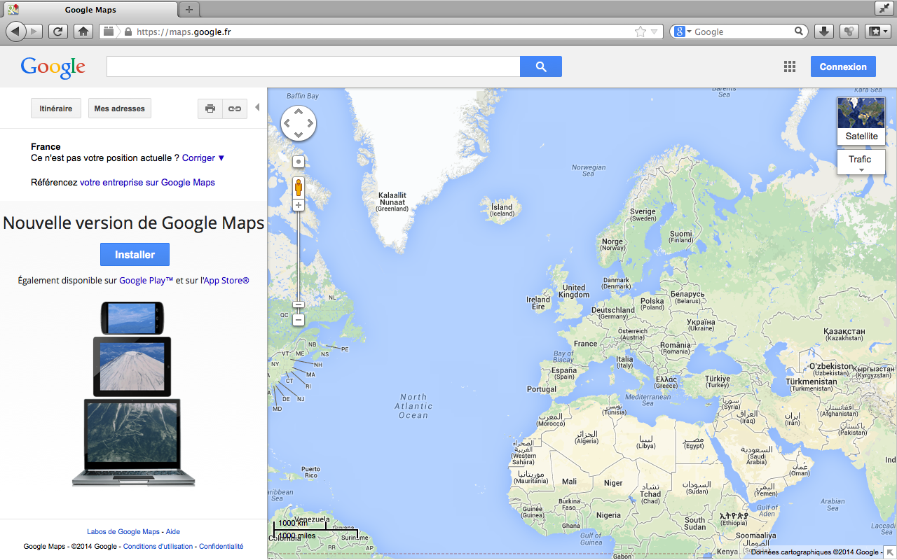

**Google Maps*, 2004–ongoing, https://maps.google.com*

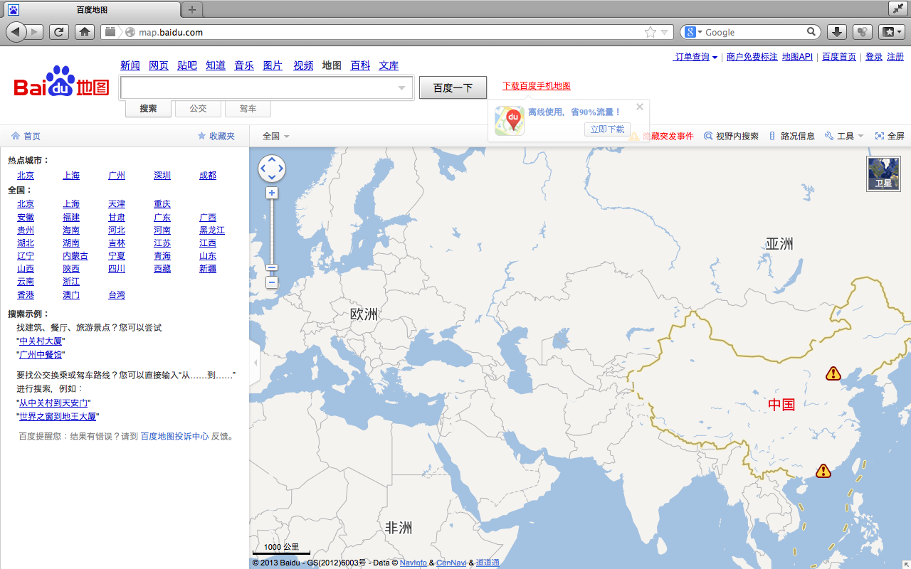

**Baidu Map*, 2010–ongoing, https://map.baidu.com</a>*

The accurate shapes of the globe are not important on the online Map for they are not subject to contradictions, differentiations or concurrency. All the online map services, from United States, Europe, Asia and Middle East are all using the Mercator projection as a structural background, a standardized, undeniable shaped territory that they inherited from its long heritage as printed Globe, and because its characteristics make it, with a totally different meaning that the one it was designed for, the most useful projection to be used as a scalable online Map. Thus the generalization of the online Map makes it collide with the purpose of the maps of more defined territories as much as with the printed Globe, which progressively becomes the archive of a territory that for a long time only took form through the structure of its lines.

As opposed to the printed Globe, the online Map generates a global territory dematerialized: the Map does not show one real territory, it shows as many territories as there are users, it is never fixed and every connection generates a new idea of territory, both global and individual, with its own specific details. It seems to be accessible everywhere, not linked anymore to the restrictions of the physical object. This separation between a physical location and an online territory, this idea that the World Wide Web is autonomous from the physical territory, or at least not more than parallel to the real territory, was early used by the collective of web artists JODI, on their website http://map.jodi.org to build their own online territory, on which a collections of projects would be linked or separated by artificial, virtual borders.

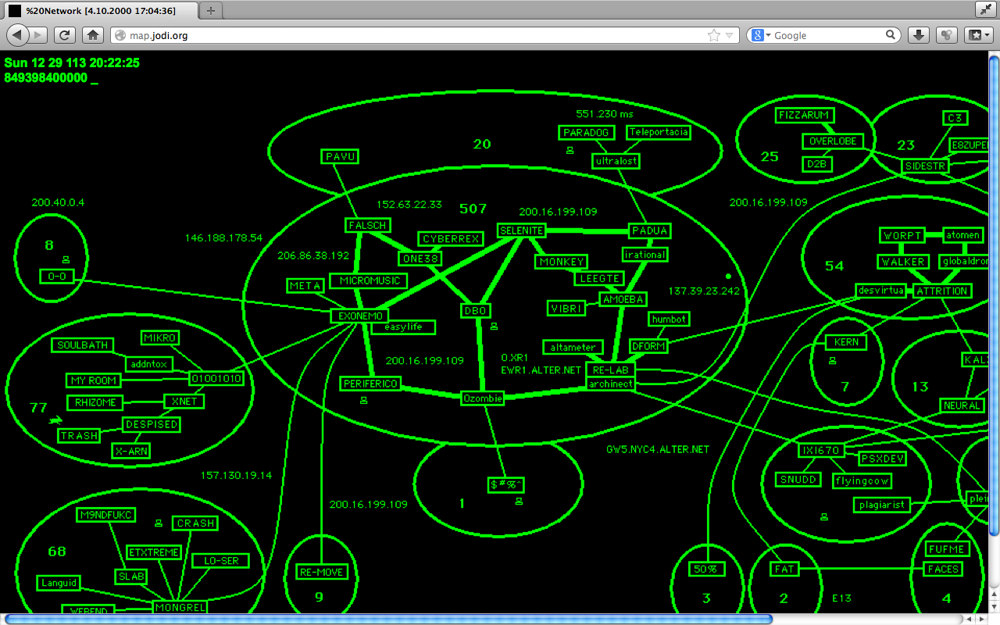

*JODI, *%20NETWORK*, http://map.jodi.org*

But a look at the 1977 *Arpanet Logical Map*, the network that would evolve into the World Wide Web, clearly reveals that the apparent dematerialization of the online Map relies on a network of deeply physical electronic devices. On the Arpanet Map, all the servers are located on the United States territory (one in Hawaii) except one being in London but connected directly and only to the American physical network. The esthetic of the map, evoking a virtual plan of electric circuits explicits through a simple diagram the inherent electronic materiality of the online territory.

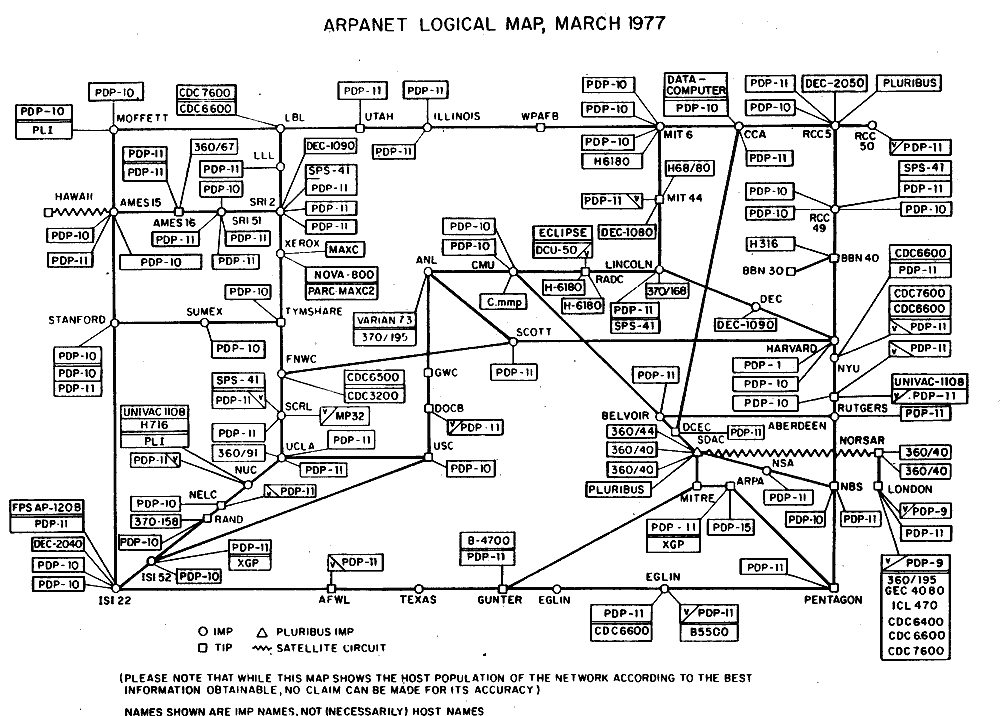

**Arpanet Logical Map*, 1977*

Although the global territories of the online Map seem disconnected from any material reality, being accessible everywhere, the user is only consulting the map, and never owns the representation of the global territory generated by the online Map. In fact, every online map services exist only in one place, fixed, private, that can only be reached, and never more than visited, through their *uniform resource locator*, URL, commonly name as the web address. Google Maps can easily be consulted at https://maps.google.com, and this network of clearly defined addresses, explicits the nature of the online territory: a maze of privately owned physical places and electronic devices, broadcasting from material locations.

Conclusion: On Creations and Appropriations of a Portrait
---------------------------------------------------------

A common feature to these portraits of *ideal* territories can be found in the gap between the ideas of territory—the *ideology* they conveyed, the reasons for which they where created within a certain context; and the ones they would be appropriated for, in another context.

The characteristics of a drawn World as an artwork free from functional restrictions, serve as much the expression of a Christian point of view than of a satirical urban one. A similar printed Globe, initially designed as an accurate navigational tool would be used as an instrument of political oppression, a tool endorsing the concept of nations, and by such an image that would eventually be questioned by artists. The image of a photographed Earth, within which lies the spectrum of a strong military and technological power, would be appropriated by utopian politics seeking independence toward these powers. An online Map, generating a restricted but distinct territory to each of its viewer also highlights an economic competition between different services, companies represented through their URL. The ability to discover so many interpretations in those representations emphasize the arbitrariness of portraying such ideals territories.

One may emit a concern regarding the online Map, as every current online map service uses as a structural background the forms inherited from the printed Globe, as a real unquestionable image over which any function would find its place. This unquestioned consideration of the representation create sense within Baudrillard’s concept of hyperreality evoked in the introduction quote. Commenting a short story [9] by Jorge Luis Borges on the failure of a perfect 1:1 map, “delivered to the Inclemencies of Sun and Winters”, Baudrillard stated, following the few words in the introduction:

> It is the map that precedes the territory—precession of simulacra—it is the map that engenders the territory and if we were to revive the fable today, it would be the territory whose shreds are slowly rotting across the map.

Sources
-------

1. Jean Baudrillard, *Simulacres et Simulation*, 1981
2. Marshall McLuhan, *The Gutenberg Galaxy: The Making of Typographic Man*, 1962
3. Marshall McLuhan, *Understanding Media: The Extensions of Man*, 1964
4.  Jean Mansel, *La Fleur des Histoires*, 1480
5. Élysée Reclus, *La terre, description des phénomènes de la vie du globe*, 1868
6. J.S. Cahill, *An Account of a New Land Map of the World, The Scottish Geographical Magazine*, 1909
7. Stewart Brand, *Whole Earth Catalog, #1010*, 1968
8. Thomas Pynchon, *Gravity’s Rainbow*, 1973
9. Jorge Luis Borges, *On Exactitude in Science*, 1946

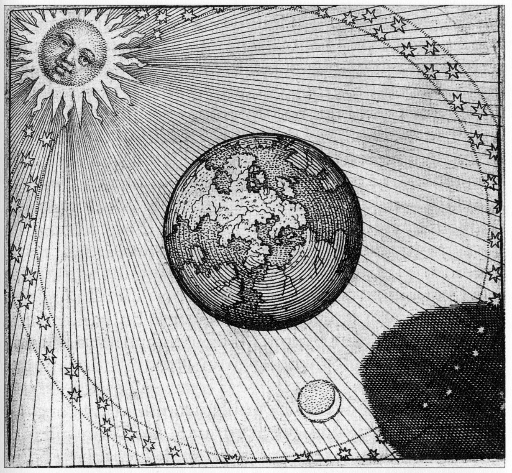

*Michael Maier, *Emblem from Atalanta Fugiens*, 1617*